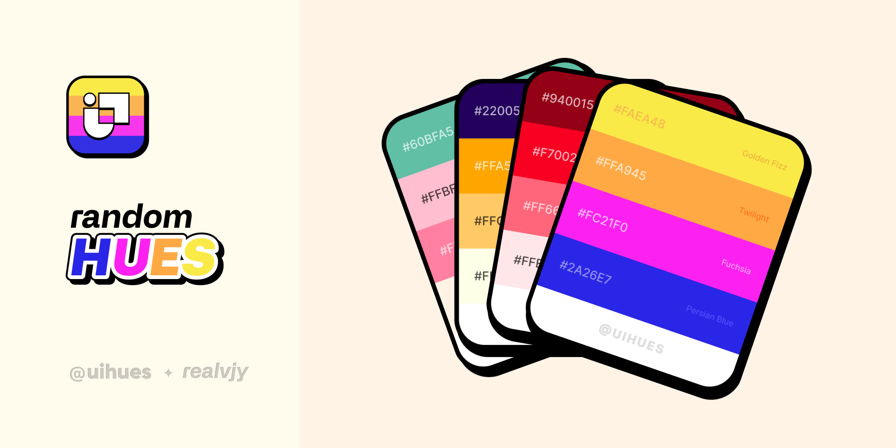

[](https://www.figma.com/community/widget/1128028298799358676/Random-Hues)

# Random Hues Figma Widget

Explore millions of color hues/shades/tones in your Figma and FigJam design files for perfect color palettes that suit your design next project.

## Features:

- By using the random button, you always get a pleasant color palette that generates in real time.
- There are millions of possible combinations to genrate your next color palette.
- Every shade of color has a name.

## Figma Community

Grab community file from 👉 here [figma community](https://www.figma.com/community/widget/1128028298799358676/Random-Hues)

## Local development

Plugin is opensource. You are welcome to contribute.

1. Clone the repository

   ```shell
   git clone
   cd random-hues
   ```

1. Install the dependencies

   ```shell
   yarn
   ```

1. Build the widget

   ```
   yarn dev
   ```

1. Open the [Figma desktop app](https://www.figma.com/downloads/)

1. Go to `Menu > Widgets > Development > Import Widget from manifest...`

1. Choose `random-hue/manifest.json`

1. Run the plugin by going to `Menu > Widgets > Development > Random Hue`

## Open source:

- [Color-scheme.js](https://github.com/c0bra/color-scheme-js) for harmonic color generation.
- [Ntc](https://www.npmjs.com/package/ntc-ts) for giving name of the color.
- Code is open-source you can support and contribute here https://github.com/realvjy/random-hue

## UIHUES:

My other project, uihues, has handcrafted color palettes. https://instagram.com/uihues

## Support & Donate

The goal of this project is to contribute to the open design community. Even though I do not intend to charge for these community resources, if random hues (uihues) has ever been useful to you or your team, I would appreciate your support! It helps to maintain server costs and keep it grow. buymeacoffee here [Github sponsor](https://github.com/sponsors/realvjy) | [Buy me a coffee](https://buymeacoffee.com/realvjy)

## Say hi or Feedback

Feel free to tag me or say hi on Twitter ([@realvjy](http://twitter.com/realvjy)). You are also welcome to share your feedback or bug reports 🙏
